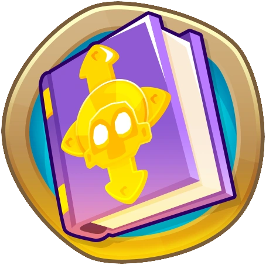

<h1 align="center">Gain Knowledge On Round 100 and 125</h1>

Gain Knowledge Points when you beat round 100 or round 125! By default you gain 1 point, but you can configure the amount in the mod settings! Works in singleplayer and co-op

